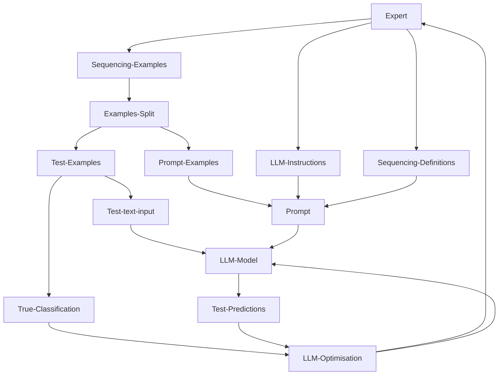
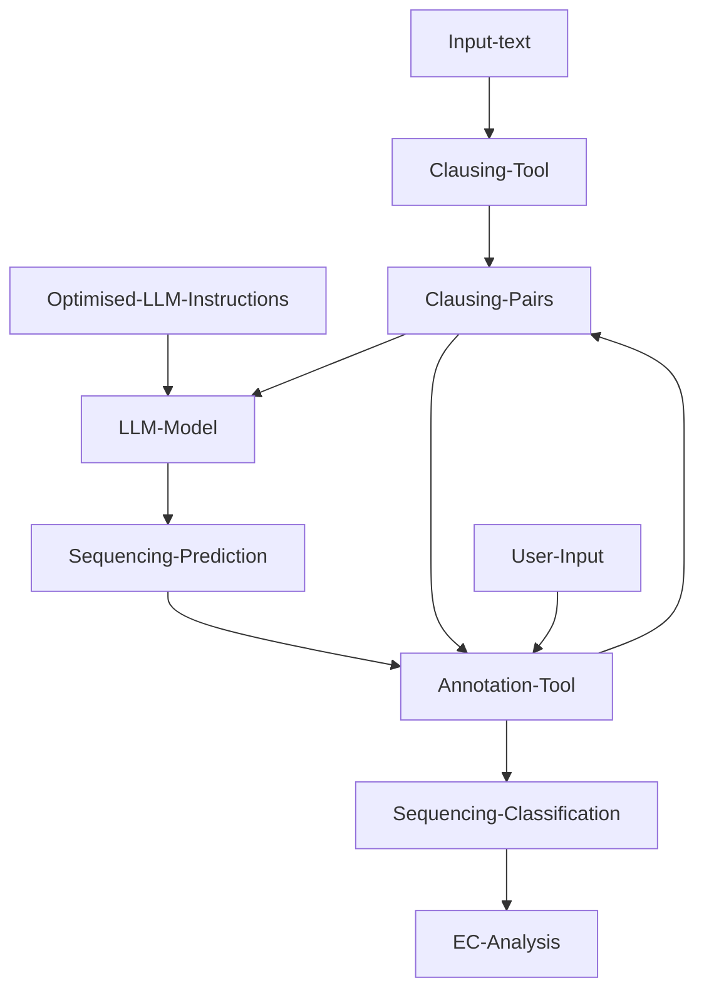

# AI Semantic Insights: LLM Toolkit for Analysing Educational Practices and Knowledge Building

## Introduction

This repository provides AI-assisted Large Language Model (LLM) tools for classifying sequencing relations between text clauses for Legitimation Code Theory (LCT). LCT is a framework developed by Prof. Karl Maton for identify and classify the ‘epistemic-semantic density (ESD)’ in English discourse, which is an approach to analyzing knowledge practices in various social fields, including education. LCT is often used to examine the underlying principles that guide knowledge building, curriculum design, pedagogical practices, and the evaluation of student work. Utilising the LCT analytic method, the complexity of knowledge practices and knowledge-building can be conceptualised and revealed from educational texts, such as the lecture transcriptions.

SIH has previously completed the ‘clausing tool’ (project PIPE-156), i.e. combining word-groupings into short, coherent standalone passages, and in turn classifying the clauses as one of the eight predefined types so that the EC can be quantitatively measured, and an information density profile of the text was generated.

This project focuses on implementing the next level of the epistemological condensation of the texts, “sequencing tool”. By combining more than one short passages (clauses), the sequencing patterns affects how the meanings are condensed from more than one passages and transported across passages. Similar to the clausing typology, the sequencing tool has a 3-level hierarchical system that consists of 8 sub-types of sequencing at the finest granularity.

## Overview

This project provides two processing tools:

1. A LLM experiment workbench to experiment with different sequencing definitions and to optimise the LLM prompts. Please see the notebook `llm_experiment_multi.ipynb` in the notebooks folder.

2. A sequencing annotation tool that allows the user to automatically extract clauses from text, and to classify the clause pairs using a pre-defined LLM (as, e.g., optimised via Step 1). To start this tool, run the notebook `annotation-tool.ipynb` or use the Web version as outlined below.

The schematic process diagrams for these two tools are shown below.

### Overview of LLM Experiment Workbench



### Overview of Sequencing Tool for Production




## Functionality

The aim of the LCT analysis tool is to provide researchers an automatic classification system that detects and identifies the sequencing types of combination of passages (clauses). Existing large language models (LLMs), such as OpenAI GPT, are applied for automatic sequencing classification.

## Usage and dependencies

### Web version

Click the `launch binder` link below to use a web version of the tool hosted on Binderhub courtesy of the Australian Text Analytics Platform.

**Note**: CILogon authentication is required. You can use your institutional, Google or Microsoft account to log in. If you have trouble authenticating, please refer to the [CILogon troubleshooting guide](docs/cilogon-troubleshooting.pdf).

[](https://binderhub.atap-binder.cloud.edu.au/v2/gh/Sydney-Informatics-Hub/LLM-LCT-sequencing/v1.1.2?labpath=annotation-tool.ipynb)

### Self-host

Run the following commands in a terminal or any Bash environment.

Clone the repository and navigate into the newly created directory:

```shell
git clone https://github.com/Sydney-Informatics-Hub/LLM-LCT-sequencing.git
cd LLM-LCT-sequencing
```

To install dependencies, ensure you have Python 3.10 and pip installed, then run the following command:

```shell
pip install -r requirements.txt
```

Serve the application locally using the following command:

```shell
panel serve annotation-tool.ipynb
```

The application will be usable in a browser at the link provided (http://localhost:5006/annotation-tool)


## References

- Maton, Karl, and Yaegan J. Doran. "Condensation: A translation device for revealing complexity of knowledge practices in discourse, part 2—clausing and sequencing." Onomázein (2017): 77-110

## Attribution and Acknowledgement
Acknowledgments are an important way for us to demonstrate the value we bring to your research. Your research outcomes are vital for ongoing funding of the Sydney Informatics Hub.

If you make use of this software for your research project, please include the following acknowledgment:

“This research was supported by the Sydney Informatics Hub, a Core Research Facility of the University of Sydney."
